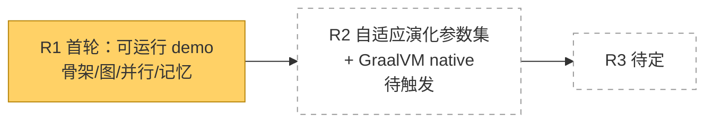
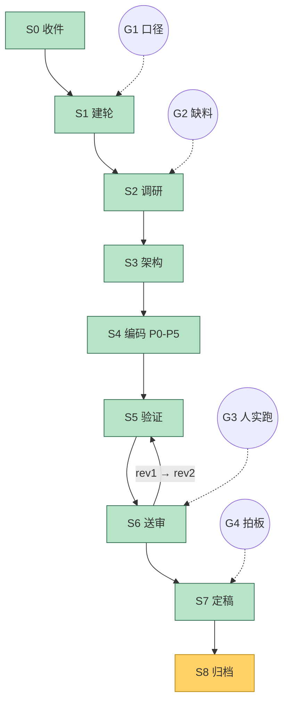

# 进度 · jagent

状态：R1 **已定稿** · 当前节点 S8 归档（P0–P5 全部完成，累计 266 断言全绿；交付物四件已建；G3 真终端实跑通过；G4 拍板=定稿并只建本地仓库，交付基线 `a8761b4`）

## 跨轮总览

## 当轮细图 R1

## 闸门

| 闸门 | 内容 | 状态 |
|---|---|---|
| G1 口径确认 | 名称/依赖/模型/构建/范围 | **已过** |
| G2 缺料求援 | 需要 OpenAI 兼容服务的 base_url 与 key | 未触发（MockClient 可离线） |
| G3 人工送审 | 由作者在本机终端实跑 demo | **已过**（原地刷新；树形连接符与状态字形整齐；中文字宽对齐正常。首跑乱码经诊断为控制台代码页 cp936 未切 UTF-8，非产品缺陷） |
| G4 人工定稿 | 决定是否发 GitHub | **已过**（拍板：定稿并**只建本地仓库**，不推远程；交付基线 `a8761b4`，68 文件入库） |

## 编码阶段进度

| 阶段 | 内容 | 状态 |
|---|---|---|
| P0 | 骨架 + JSON/SSE + doctor | **完成**（构建成功；doctor 实测 stdout=GBK，UTF-8 流已强制重建；JSON 19/19） |
| P1 | LLM 流式 + Mock | **完成**（Lang 槽位机制一并落地；P1T 26/26） |
| P2 | ReAct + 工具 | **完成**（6 工具 + 路径越界拒绝；mock 3 轮自主收尾；P2T 27/27） |
| P3 | 图 + Unicode 渲染 + 并行 | **完成**（两工具 RUNNING 重叠 201ms；树形连接符与字形正确；P3T 32/32） |
| P4 | 多 agent + 元机制 | **完成**（报价行打印；两个子 agent 在图上并行分叉；并发度随错误率 4→1；P4T 61/61） |
| P5 | 记忆 + 语义压缩 | **完成**（`work/` 长出协议文件；压缩行打印 ROI 依据；`--resume` 从 `plan.md` 的 `goal:` 续跑成功；**P5T 120/120**） |
| 交付 | README / docs / 基准 | **完成**（`README.md`、`docs/PROTOCOL.md`、`docs/DEMO.md`、`R1_50_bench_startup.wip.md`；启动中位 70ms、jar 129KiB） |
