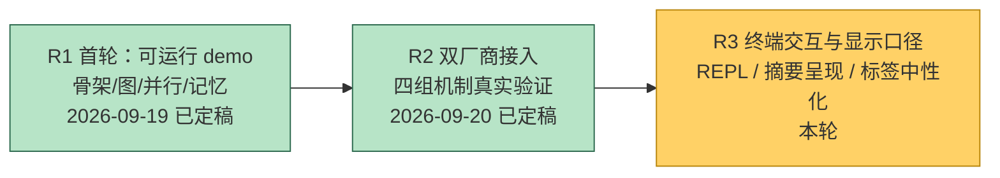
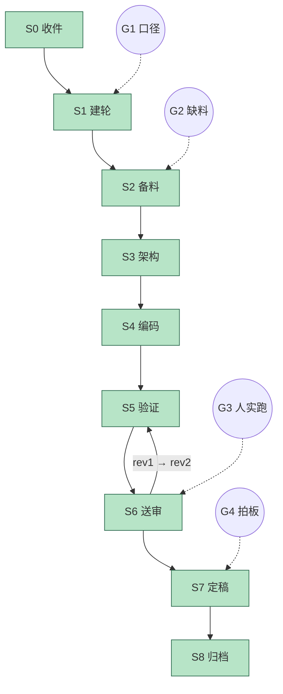

# 进度 · jagent

状态：**R2 已定稿**（2026-09-20 作者 G4 拍板冻结）· R3 已开轮（触发见 `R3_00_req_product.in.txt`）
R2 收尾结论：真双厂商跑通，四组机制在真实厂商下全部验证；作者复核时另提四项新意见，**不在 R2 内修**，整体转 R3。

## 跨轮总览

## 当轮细图 R2

> S6 送审共走两回：首回暴露思维链 400 与两处并发死锁（见下），退回 S5 修完再送，第二回通过。

## 闸门

| 闸门 | 内容 | 状态 |
|---|---|---|
| G1 口径确认 | 范围 / 第二厂商归属 / 密钥投喂方式 | **已过**（初判"双模型接入+档位选择验证"，作者随后追加至**四组机制全测**，见修订 2b；厂商由作者自定且产品**厂商无关**；密钥由作者写入 `work/jagent.properties`） |
| G2 缺料求援 | 两个厂商的 `base_url` / `api_key` / `model` | **已过**（作者已投喂两档真实配置到 `work/jagent.properties`，两档分属两家） |
| G3 人工送审 | 作者在本机真终端实跑真实厂商；收尾看"对账"块即可判定四组机制是否生效 | **已过**（五个真实场景 d1–d5 全部跑通；首回暴露 3 处缺陷，退回 S5 修完后第二回通过） |
| G4 人工定稿 | 冻结 R2 | **已过**（2026-09-20 作者拍板冻结；四项新意见不并入本轮，整体转 R3） |

## 编码阶段进度

| 阶段 | 内容 | 状态 |
|---|---|---|
| P0 | 双档位独立配置（`Config` 增强档地址/密钥） | **完成** |
| P1 | 档位化客户端工厂（`Cli.client()` 按档取用） | **完成** |
| P2 | 缺配置快速失败（`badCfg()` 前置校验，不再撞到运行期才报错） | **完成** |
| P3 | doctor/help 展示双档位 + 同源提示 | **完成** |
| P4 | lang 键中英同步（新增 9 键，删除 3 死键） | **完成** |
| P5 | 断言 P6T（79 条）+ R1 回归 266 条 | **完成**（345 全绿） |
| P6 | mock 自测（`run` 端到端 + 双档标签） | **完成** |
| P7 | 机制计数（Auction/Governor/Admission/Fallback 原地累加） | **完成** |
| P8 | 对账单（`Scorecard` + `work/scorecard.txt`） | **完成** |
| P9 | 断言 P7T（109 条） | **完成** |
| P10 | mock 电池：A 基线 / B 预算压力 / C 压缩 / D 自适应并发控制 / E 故障注入 | **完成** |
| P11 | 真实厂商最简 agent 跑通 | **完成**（d1：3 步 6 节点，写入并读回成功） |
| P12 | 真实厂商全对账证据固化 | **完成**（d1–d5 五场景，见下） |
| P13 | 思维链模型多轮 400 修复（`reasoning_content` 捕获+回传） | **完成**（P1T 增 4 断言） |
| P14 | `Admission.setLimit` 降额阻塞死锁修复（改非阻塞回收） | **完成** |
| P15 | 嵌套许可死锁修复（许可只约束顶层提交） | **完成** |

## 机制验证结论（mock，2026-09-19）

证据件：`R2_50_mech_evidence.wip.txt`；脚本：`R2_95_mech_battery.sh`。

| 机制 | 证据 | 结论 |
|---|---|---|
| 档位选择 | A 场景 10 次报价、强力档 10:0；B 场景加预算压力后翻转为 5:5 | **活**，随预算压力改变选择 |
| 成功率 | E 场景失败后强力档成功率 1.00 -> 0.75 | **活**，事后结算生效 |
| 预算 | B 场景 2258/1000 (226%)；A 场景 2258/40000 (6%) | **活** |
| 压缩 ROI | C 场景 3 次压缩、省 518 tok；A/B/D 均 0 次（未达阈值） | **活** |
| 净收益 | A +1.38；B 预算压力下转为 -1.23 | **活**，可与预算同屏对账 |
| 闭环调参 | D 场景 `--permits 1` 起手，上调 7 次至上限 8（峰值 6→2，见下方语义变更） | **活** |
| 熔断 | E 场景 熔断 1 次、下调 2 次、错误率 49% | **活** |
| 执行图 | A 26 节点全完成；C 因压缩多 3 节点；E 失败 2 | **活** |
| 路径互斥 | 五个场景均 0 冲突（mock 不写同一路径） | 仅 P7T 单测覆盖 |

**发现（记入 R3）**：熔断阈值 `tripAt=3`，但单次模型调用失败即中止整轮，
而 `FallbackClient` 的 `maxAttempts=2` 使单轮内最多累计 2 次失败 ——
**跨厂商自动切换在"一次运行"内无法自然触发**。当前熔断只对"多次调用的长任务"起作用。
选项：(a) 降 `tripAt`；(b) 让模型调用失败不再中止整轮而是换档重试；(c) 保持现状并在文档说明。

## 机制验证结论（真实双厂商，2026-09-20）

证据件：`R2_51_real_vendor_evidence.wip.txt`（内含 A–E 五段）；日志：`demo-run/d1..d5.log`。
两档分属两家真实厂商（名称按宪法 #7 不入库）。

| 场景 | 内容 | 结果 |
|---|---|---|
| d1 基线 | 写文件并读回 | 3 步 6 节点，强力档采纳，成功 |
| d2 预算压力 | `--budget 1200` | **档位选择真翻转**：轮1 强力档 0.44/0.51；轮2 廉价档 0.18/0.15 采纳；轮3 廉价档。两档各自真实执行了工具调用 |
| d3 并发 | 并行派两个子 agent | 6 步 37 节点（完成 31 / 失败 6）；峰值 2；上调 9 下调 3 熔断 1；降级 12 重试 2 |
| d4 压缩 | `--compress-after 100` | 1 次压缩，省 211 tok，ROI 1743.5x |
| d5 故障注入 | 真实 429 限流 | 熔断 1、下调 2、重试 1、错误率 49%；强力档成功率 1.00→0.75；本轮中止 |

| 机制 | 真实厂商证据 | 判定 |
|---|---|---|
| 档位选择 | d2 同一次运行内先强力档后廉价档；d3 共 14 次、廉价 3 / 强力 11 | **活** |
| 成功率 | d3 廉价档 1.00 -> 0.75（失败结算），强力档 0.98；d5 强力档 1.00 -> 0.75 | **活** |
| 预算 | d2 347%；d3 57%；d4 5% | **活** |
| 压缩 ROI | d4 1 次、省 211 tok、ROI 1743.5x | **活** |
| 闭环调参+熔断 | d3 峰值 2、上调 9、下调 3、熔断 1、错误率 2%；d5 熔断 1、下调 2、错误率 49% | **活** |
| 降级/重试 | d3 备用档切换 12 次、重试 2 次；d5 重试 1 次 | **活** |
| 执行图 | d3 37 节点三态齐备；d5 失败 2 | **活** |

**真实厂商下新增发现**

1. **思维链模型必须回传推理**：廉价档为 thinking 模型，多轮工具回合不回传 `reasoning_content`
   即 http 400。已在客户端捕获并回传（空值不发，兼容非思维链厂商）。→ 已修，P1T +4 断言。
2. **并发子 agent 死锁（两处）**：
   (a) `Admission.setLimit` 降额时 `acquireUninterruptibly` 等一个被"正在调用 setLimit 的线程"
   自己持有的许可 → 环；
   (b) 更根本：`spawn_agent` 任务持有许可，其派出的子 agent 工具调用又要许可 → 父等子、子等许可。
   两处均已修（降额改非阻塞回收；许可只约束顶层提交）。**mock 下不复现**——mock 太快，许可总能及时释放。
3. **子 agent 工作区不隔离**：d3 两个子 agent 共享同一目录，互相读到对方产物，独立性不成立。
   → 记入 R3。
4. **语义变更（修复的副作用）**：嵌套许可修复后，"并发峰值"只统计**顶层提交**，嵌套子 agent 的
   工具调用不再计入 → mock D 场景峰值由 6 降为 2。机制本身（上调/下调/熔断）不受影响；
   P7T 的并发断言不受影响（均从非许可线程提交）。

## 阻塞项

- 无。G1–G4 全部通过，R2 已定稿（冻结清单见 `R2_93_frozen.md`）。
- 作者复核时提的四项新意见（节点摘要显示不全 / chat 推理与答案同行 / 要 REPL / 机制标签中性化）
  经作者 2026-09-20 裁定**不并入 R2**，整体转 R3，见 `R2_94_rounds.md` 的 R3 节。
