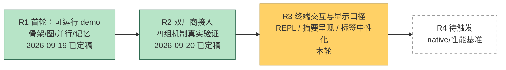
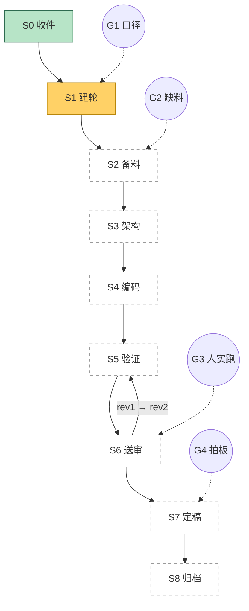

# 进度 · jagent

状态：R3 进行中 · 当前节点 S1（口径已锁，待作者确认后进 S2 备料 / S3 架构）

## 跨轮总览

## 当轮细图 R3

## 闸门

| 闸门 | 内容 | 状态 |
|---|---|---|
| G1 口径确认 | 四项范围 / 改动层次 / 换词幅度 / REPL 形态 / 进化论去留 | **已问**（作者 2026-09-20 已答全部五项，见 `R3_10` §2；待作者过目 `R3_10` 后正式过闸） |
| G2 缺料求援 | 本轮暂未见缺料 | 待 |
| G3 人工实跑 | 作者在本机真终端试 REPL 与新的摘要呈现 | 待 |
| G4 人工定稿 | 冻结 R3 | 待 |

## 编码阶段进度

| 阶段 | 内容 | 状态 |
|---|---|---|
| P0 | 机制标签中性化（六词转固定英文，只改显示层） | 未开工 |
| P1 | 执行图改画结构与状态、末尾统一总结 | 未开工 |
| P2 | `chat` 推理与答案分行 | 未开工 |
| P3 | REPL 基础版（提示符 + 读一行跑一行） | 未开工 |
| P4 | lang 键中英对称性回归 | 未开工 |
| P5 | 断言（新增 + R1/R2 全套回归 458） | 未开工 |
| P6 | mock 端到端自测 | 未开工 |
| P7 | 真实厂商复跑（沿用 `work/jagent.properties` 两档） | 未开工 |

## 阻塞项

- 无。
