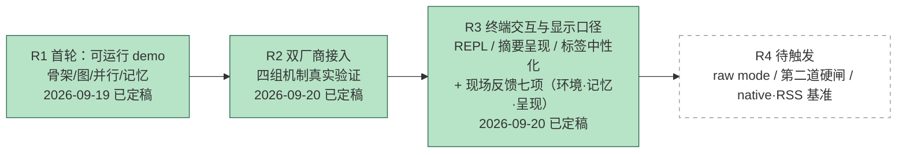
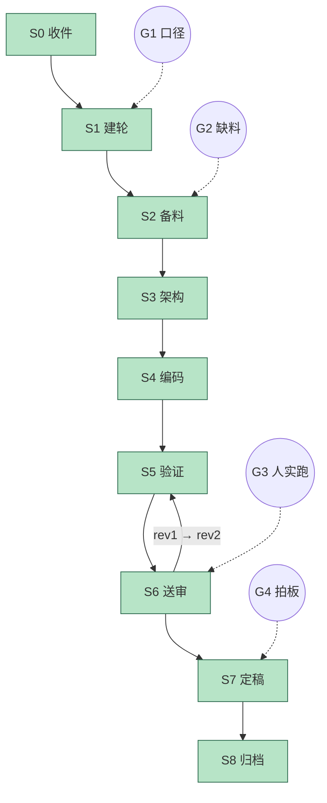

# 进度 · jagent

状态：R3 已完成 · G3 已过 · G4 已拍板定稿（2026-09-20） · 当前节点 S8（归档）

## 跨轮总览

## 当轮细图 R3

## 闸门

| 闸门 | 内容 | 状态 |
|---|---|---|
| G1 口径确认 | 四项范围 / 改动层次 / 换词表 / REPL 形态与入口 / 自适应演化去留 | **已过**（作者 2026-09-20 分四问答全，逐项落 `R3_10` §2；替换表 9 词已确认）。编码中另有两次范围收缩（§2.1）、G3 现场追加四项（§2.2）、编码后追加步数上限改配置项（§2.3）、G3 现场二次追加收尾只留 `answer`（§2.4） |
| G2 缺料求援 | 本轮暂未见缺料 | 未触发 |
| G3 人工实跑 | 作者在本机真终端试 REPL、`answer` 收尾观感，以及「查当前日期」这类现场反馈 | **已过**（作者 2026-09-20 实跑一个相关场景，基本成功；原话「感觉还不错」。未指出具体缺陷条目 —— 两回现场反馈共七项均已落地并断言覆盖） |
| G4 人工定稿 | 冻结 R3 | **已拍板**（作者 2026-09-20：现在冻结 · 两个提交同 R1/R2）。交付基线 `630f92b`，冻结清单见 `R3_93_frozen.md` |

## 编码阶段进度

| 阶段 | 内容 | 状态 |
|---|---|---|
| P0 | 机制标签中性化（9 词 + 整批 L1 标签转固定英文，zh=eng） | **完成** |
| P1 | 执行图改画结构与状态、末尾统一总结（note=`answer`，`clip` 60） | **完成** |
| P2 | ~~`chat` 推理与答案分行~~ → **作废**（§2.1a 取消 `chat`） | 作废 |
| P3 | REPL 基础版（`> ` 提示符 + 读一行跑一行 + `:help`/`exit`） | **完成** |
| P4 | 取消 `chat`（子命令 / 帮助行 / `cmd.chat` / REPL 模式） | **完成** |
| P5 | 文档同步（README / docs/DEMO） | **完成** |
| P6 | 断言（`R3T` 新建 + P3T/P7T 随标签同步 + 全套回归） | **完成** |
| P7 | 系统提示补环境信息 + `bash` 平台说明（`Env` / `system.txt` / `Config`） | **完成** |
| P8 | `bash` 工具：子进程 stdin 关闭 + 按控制台原生编码解码 | **完成**（`date` 10s 超时 → 54ms；`echo 中文` 解码正确，已实测探针确认） |
| P9 | 记忆贯通：`runs.md` 落盘回灌 + 会话内上下文（`Memory.recordRun` / `Agent.prior`） | **完成** |
| P10 | 呈现：`Text.plain` 剥 Markdown + 收尾总结 + 去掉重复打印 | **完成**（收尾载体后由 P15 改为 `answer` 单段） |
| P11 | 文档同步（README / `docs/DEMO.md` §13–15 / `docs/PROTOCOL.md` §3.3 §5 §7） | **完成** |
| P12 | 断言扩充（`R3T[11]`–`[15]`）+ 全套回归 | **完成**（638 全绿；`R3T` 106 → 180） |
| P13 | 真实厂商复跑 | **本轮不需要** —— 改的是呈现层，机制未动；由 G3 人工实跑覆盖 |
| P14 | 步数上限改配置项（`Config.intAny` / 循环哨兵 / `SpawnTool` 透传 / 帮助行）+ 断言 | **完成**（§2.3；`R3T[16]`） |
| P15 | 收尾只留 `answer`（删「本轮总结」块 / 失败与中止并入 `answer` / `argBrief` 摘要工具参数 / 对账块与报价行挂 `--scorecard`）+ 断言 | **完成**（§2.4；`R3T[15][17]`；666 全绿） |

## 阻塞项

- 无。R3 已定稿冻结（交付基线 `630f92b`）。下一轮（R4）待作者触发。
