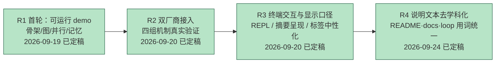
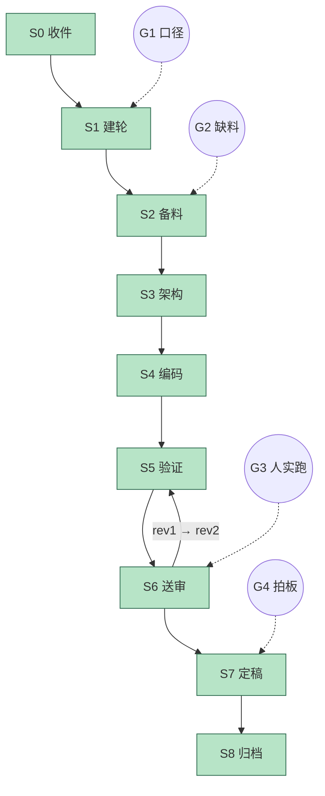

# 进度 · jagent

状态：R4 已定稿 · G3 已过 · G4 已拍板冻结（2026-09-24） · 当前节点 S8（归档）

## 跨轮总览

## 当轮细图 R4

## 闸门

| 闸门 | 内容 | 状态 |
|---|---|---|
| G1 口径确认 | 轮次形式 / 只读存档去留 / §1 去留 / 用词风格（禁「成本收益」） | **已过**（作者 2026-09-24 四问四答全，落 `R4_00` 与 `R4_10` §2） |
| G2 缺料求援 | 本轮不缺料（全部输入来自作者指令与既有文件） | 未触发 |
| G3 人工实跑 | 作者复核：确认学科借词已清、代码未改 | **已过**（作者 2026-09-24 以「确定学科化的都去除了并没有改代码」一问验收；本轮只动说明文本与语言包文案，未单独终端实跑） |
| G4 人工定稿 | 冻结 R4 | **已拍板**（作者 2026-09-24「可以，这一轮结束」）。交付基线 `2917c0c`，冻结清单见 `R4_93_frozen.md` |

## 编码阶段进度

| 阶段 | 内容 | 状态 |
|---|---|---|
| P0 | 残留扫描：定位 `loop/` / `README` / `docs/` 内全部学科借词与出现次数 | **完成** |
| P1 | 术语映射表定案（25 条机械替换 + 6 条修辞修正，禁「成本收益」） | **完成**（`R4_10` §3） |
| P2 | `README.md` / `docs/DEMO.md` / `docs/PROTOCOL.md` 措辞替换 | **完成**（主替换 74 处） |
| P3 | `loop/` 说明性文件措辞替换（`*.in.txt` 与证据件除外） | **完成**（主替换 251 处） |
| P4 | 机械替换的二次修辞修正（熔断触发→熔断、去冗余前缀等） | **完成**（35 处：README/docs 10 + loop 25） |
| P5 | `README` §1 项目定义改写 + 状态节改 R4/R5 口径 | **完成** |
| P6 | 宪法 §1 改写（落 `R4_90` 修订 1） | **完成** |
| P7 | `lang/{zh,eng}.properties` 三处用户文案更新（键对称） | **完成**（zh 3 键 / eng 2 键） |
| P8 | 残留扫描复验（借词仅存于「保持原样」文件与 R4 记录）+ 禁用词扫描 | **完成**（扫描确认 0 越界命中） |
| P8.5 | **第二轮宽扫收口**：换更宽候选词表全库扫描，补掉表外 4 词 | **完成**（基因组→参数集 / 变异算子→变异操作 / 资产→产出 / 出价→报价，共 31 处；映射表补第 26–29 条） |
| P9 | 回归复跑（lang 是断言数据源，同步进 `target/classes` 后跑全套） | **完成**（666 全绿：30/27/32/61/120/79/109/208） |
| P10 | R4 记录（`R4_00` / `R4_10` / `R4_90` / `R4_91` / `R4_92` / `R4_93` / `R4_94`） | **完成** |

## 阻塞项

- 无。R4 已定稿冻结（交付基线 `2917c0c`）。下一轮（R5）待作者触发。
